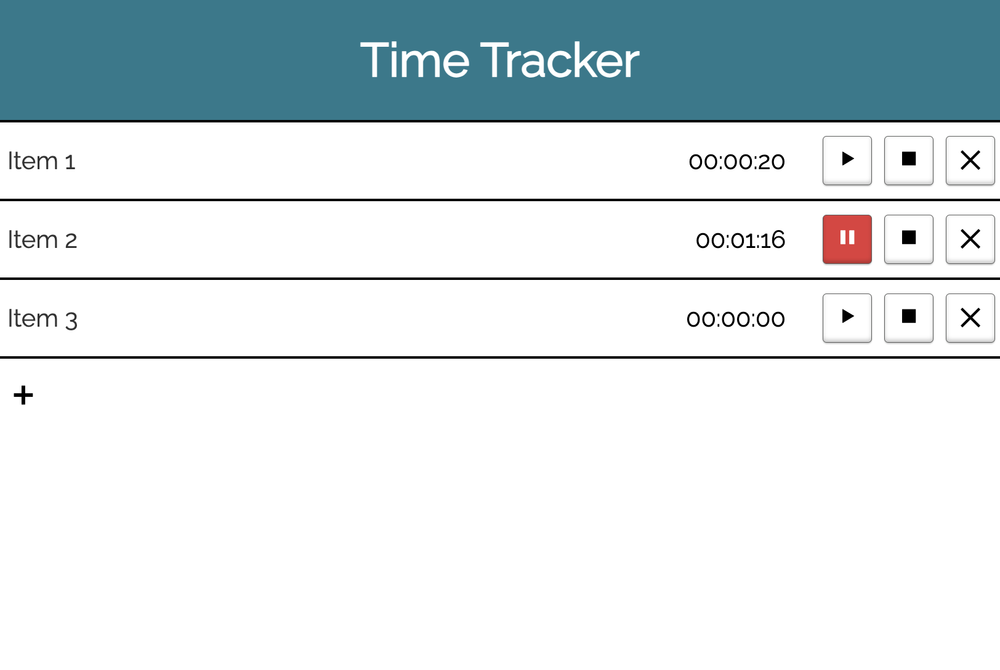

## What is TimeTracker?

TimeTracker is a simple web app that consists of a list of timers that can be individually controlled to track your time throughout the day as you switch between tasks. It is written in Svelte and stores the timers in the Browsers Cookies.
